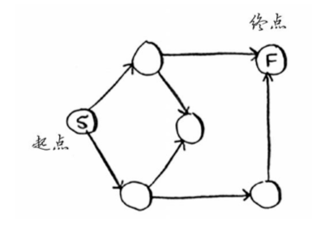
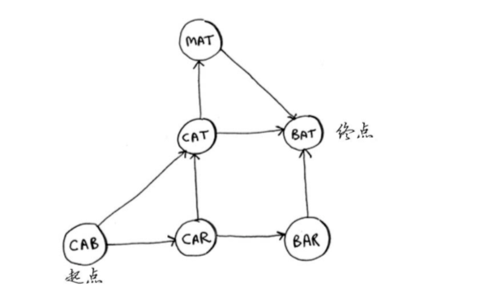
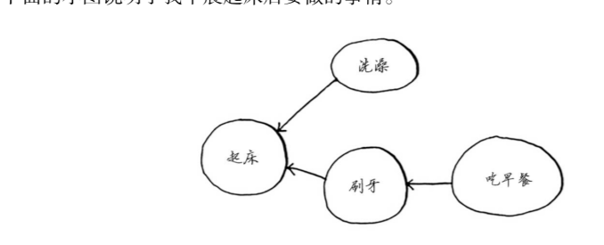
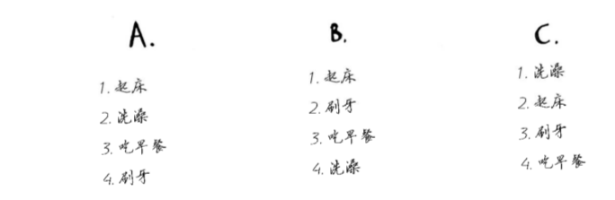
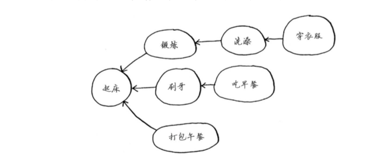
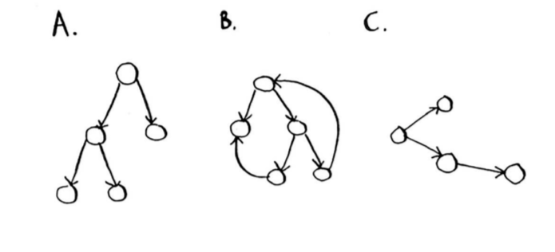

对于下面的每个图，使用广度优先搜索算法来找出答案。

6.1 找出从起点到终点的最短路径的长度。

>
最短路径为2, 从S到右上角节点再到F

6.2 找出从cab到bat的最短路径的长度。

>
最短路径为2, 从CAB到CAT到BAT

下面的小图说明了我早晨起床后要做的事情。

该图指出，我不能没刷牙就吃早餐，因此“吃早餐”依赖于“刷牙”。 另一方面，洗澡不依赖于刷牙，因为我可以先洗澡再刷牙。根据这个图，可创建一个列表，
指出我需要按什么顺序完成早晨起床后要做的事情：
(1) 起床 
(2) 洗澡 
(3) 刷牙 
(4) 吃早餐 
请注意，“洗澡”可随便移动，因此下面的列表也可行： 
(1) 起床 
(2) 刷牙 
(3) 洗澡
(4) 吃早餐
6.3 请问下面的三个列表哪些可行、哪些不可行？

A不可行,刷牙不能在吃早餐之后 B可以 C不行,先起床然后再刷牙

6.4 下面是一个更大的图，请根据它创建一个可行的列表。

1——起床，2——锻炼，3——洗澡，4——刷牙，5——穿衣服，6——打包午餐，7——
吃早餐。

从某种程度上说，这种列表是有序的。如果任务A依赖于任务B，在列表中任务A就必须在任 务B后面。这被称为拓扑排序，使用它可根据图创建一个有序列表。假设你正在规划一场婚 礼，并有一个很大的图，其中充斥着需要做的事情，但却不知道要从哪里开始。这时就可使
用拓扑排序来创建一个有序的任务列表。

6.5 请问下面哪个图也是树？

A,C是 B不是

